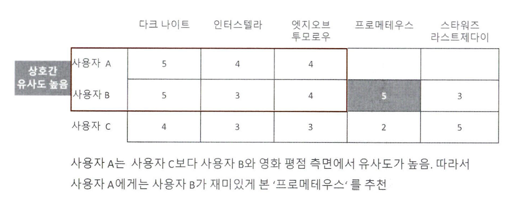

# 추천 시스템이란
추천 시스템은 사용자에게 개인화된 추천을 제공하기 위해 데이터 분석 및 머신러닝 기술을 활용하는 시스템이다. 이를 통해 사용자는 자신의 선호도와 행동 데이터를 기반으로 맞춤형 상품, 콘텐츠, 서비스를 추천받을 수 있다.  
  
잘 만들어진 추천 시스템은 사용자가 무엇을 원하는지 빠르게 찾아주기 때문에, 선택의 어려움을 줄이고 서비스 이용의 즐거움을 극대화할 수 있다.  
  
- 추천 시스템의 유형
1. 콘텐츠 기반 필터링(Content based filtering)
    - 사용자가 특정 아이템을 매우 선호하는 경우, 그 아이템과 비슷한 콘텐츠를 가진 다른 아이템을 추천
    - 장르, 감독, 출연배우, 키워드 등을 고려하여 유사한 영화 추천

2. 협업 필터링(Collaborative Filtering)
    - 사용자 평점 정보나 상품 구매 이력과 같은 사용자 행동 양식(user behavior)만을 기반으로 추천
    - 협업 필터링의 주요 목표는 사용자-아이템 평점 매트릭스와 같은 축적된 사용자 행동 데이터를 기반으로 사용자가 아직 평가자지 않은 아이템을 예측 평가(Predicted Rating)하는 것
    - 행(row)은 개별 사용자, 열(col)은 개별 아이템으로 구성, val값은 평점
    - 일반적으로 희소 행렬(Sparse Matrix) 특성을 가짐.
    
    
    1) 최근접 이웃(Nearest Neighboring) 협업 필터링
        - 메모리(Memory) 협업 필터링이라고도 함
        i. 사용자 기반(User-User)
            - 당신과 비슷한 고객들이 다음 상품도 구매했습니다.
            - 특정 사용자와 유사한 다른 사용자를 Top-N으로 선정해 이 Top-N 사용자가 좋아하는 아이템을 추천하는 방식  
            

        ii. 아이템 기반(Item-Item)
            - 이 상품을 선택한 다른 고객들은 다음 상품도 구매했습니다.
            - 사용자들이 그 아이템을 좋아하는지/싫어하는지의 평가척도가 유사한 아이템을 추천하는 방식   
            - 사용자 기반 최근접 이웃 데이터 세트와 행과 열이 서로 반대임  
            

        - 일반적으로 사용자 기반보다는 아이템 기반 협업 필터링이 정확도가 더 높다. 비슷한 영화를 좋아한다고 해서 취향이 비슷하다고 판단하기는 어렵기 때문. 유명 영화는 취향과 관계 없이 대부분의 사람이 관람하는 경우가 많을 뿐더러, 사용자들이 평점을 매긴 영화의 개수가 많지 않는 경우가 대부분임.
        - 유사도 측정에 코사인 유사도를 주로 이용

    2) 잠재 요인(Latent Factor) 협업 필터링
        - 사용자-아이템 평점 매트릭스 속에 숨어 있는 잠재 요인을 추출해 추천 예측을 할 수 있게 하는 기법
        - 대규모 다차원 행렬을 SVD와 같은 차원 감소 기법으로 분해하는 과정에서 잠재 요인을 추출(행렬 분해, Matrix Fatorization)
        - 다차원 희소 행렬인 사용자-아이템 행렬 데이터를 저차원 밀집 행렬인 사용자-잠재 요인 행렬과 아이템-잠재 요인 행렬의 전치 행렬로 분해할 수 있으며, 이렇게 분해된 두 행렬의 내적을 통해 새로운 예측 사용자-아이템 평점 행렬 데이터를 만들어서 사용자가 아직 평점을 부여하지 않는 아이템에 대한 예측 평점을 생성함.  
        
        
        - '잠재요인'이 무엇인지는 명확하게 정의하기 곤란
        - R(u, i) : 사용자의 아이템에 대한 평점
        - P(u, k) : 사용자의 영화 장르별 선호도 행렬
        - Q(i, k) : 영화별로 여러 장르 요소로 구성된 영화의 장르별 요소 행렬
        - 평점이란 사용자의 특정 영화 장르에 대한 선호도와 개별 영화의 장르적 특성값을 반영해 결정된다고 생각할 수 있음.
        - P와 Q를 내적 계산하면 예측 평점을 구할 수 있음

        

# 추천 시스템의 사례
하나의 콘텐츠를 선택했을 때, 선택된 콘텐츠와 연관된 추천 콘텐츠가 얼마나 사용자의 관심을 끌고 개인에게 맞춘 콘텐츠를 추천했는 지는 매출과 깊게 연관되어 있다.

1. 유튜브 / 넷플릭스
- 사용자의 시청 기록과 평점을 기반으로 관련 동영상 추천.

2. 아마존
- 상품 구매 기록과 관련된 추천 상품 제공.
- '이 제품을 구매한 사람들이 함께 본 상품'.

# 행렬 분해
- 다차원의 매트릭스를 저차원의 매트릭스로 분해하는 기법
- SVD(Singular Vector Decomposition), NMF(Non-Negative Matrix Factorization) 등이 있음

* R = P * Q.T
- M : 사용자 수, N : 아이템 수, K : 잠재요인 차원 수  
- R : M x N 차원의 사용자-아이템 평점 행렬
- P : M x K 차원의 사용자-잠재요인 행렬
- Q : N x K 차원의 아이템-잠재요인 행렬

- NaN 값을 많이 가지는 고차원 희소행렬인 R 행렬을 저차원 밀집행렬인 P, Q 행렬로 분해

- NaN값을 유추할 수 있게 됨!

### SVD 행렬분해 알고리즘
- SVD는 NaN값이 없는 행렬에만 적용 가능
- NaN 값이 있는 경우 [확률적 경사 하강법(SGD, Stochastic Gradient Descent)](https://en.wikipedia.org/wiki/Stochastic_gradient_descent) 이나 [ALS(Alternating Least Squares)](https://blog.firstpenguine.school/4) 방식을 이용해 SVD를 수행할 수 있음